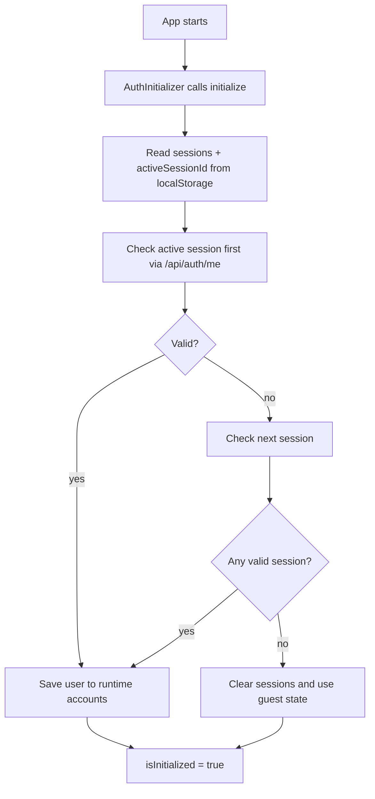
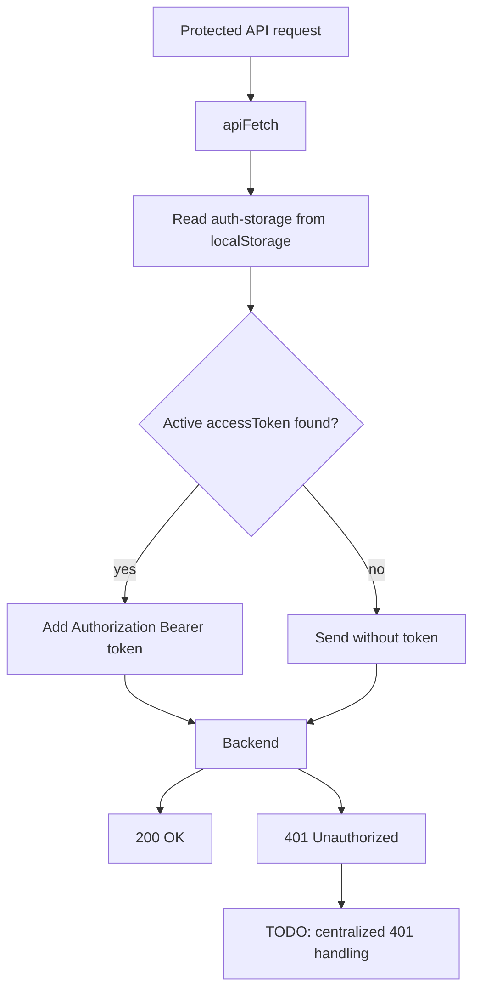

# Авторизация и multi-account в MrSimon

Документ описывает текущую архитектурную модель авторизации в MrSimon: один браузер может хранить несколько авторизованных аккаунтов и переключаться между ними через account switcher.

Это практическое решение для клиентской части и API, а не учебник по JWT. Важная идея: браузер хранит несколько локальных технических сессий, но в каждый момент времени активна только одна.

## Цель

В MrSimon нужен сценарий, где на одном устройстве могут быть авторизованы несколько людей.

- На одном рабочем ПК в учебном центре могут быть авторизованы несколько преподавателей.
- Дома на одном компьютере могут быть авторизованы несколько учеников, например братья/сёстры.
- Пользователь должен выбирать активный аккаунт из списка уже авторизованных аккаунтов.
- Переключение аккаунта не должно требовать повторного ввода логина и пароля, пока локальная сессия валидна.
- Данные аккаунта должны подтверждаться backend-ом, а не считаться доверенными только потому, что они лежат в браузере.

## Разделение понятий

В этой модели важно не смешивать три разные задачи.

- **Authentication** — ответ на вопрос, кто пользователь. В текущей реализации это JWT Bearer token и endpoint `GET /api/auth/me`.
- **Authorization** — ответ на вопрос, какие права и разделы доступны пользователю. Сейчас в `UserDto` есть `role`, но полноценная модель прав должна развиваться отдельно.
- **Multi-account switching** — ответ на вопрос, какой из нескольких уже авторизованных аккаунтов сейчас активен в этом браузере.
- Роли не переключаются вручную пользователем. Пользователь переключает аккаунт, а не роль.
- Доступы в будущем должны задаваться администратором через permissions/разделы, а не через ручный выбор роли в UI.

## Backend-модель

Backend использует JWT Bearer auth.

В `Program.cs` подключена схема:

```csharp
AddAuthentication(JwtBearerDefaults.AuthenticationScheme)
```

После `login` или `register` backend возвращает `AuthResponse`:

```json
{
  "user": {
    "id": "...",
    "name": "...",
    "lastName": "...",
    "email": "...",
    "role": "User"
  },
  "accessToken": "..."
}
```

`Cookie-auth` не используется для multi-account режима. Cookie естественно описывает одну активную браузерную сессию, а здесь один браузер должен держать несколько независимых авторизованных аккаунтов.

`GET /api/auth/me` защищен `[Authorize]` и возвращает краткую информацию о пользователе по переданному Bearer token. Frontend вызывает этот endpoint с конкретным `accessToken`, когда нужно проверить сессию или загрузить данные аккаунта.

Logout в MVP выполняется на frontend: удалить локальную сессию из Zustand/localStorage. Backend пока не хранит серверную запись сессии и не отзывает JWT.

В коде есть комментарий в `Program.cs`: `Сначала проверяем, есть ли auth-cookie и кто пользователь`. По фактической реализации это уже JWT Bearer, поэтому комментарий стоит считать устаревшим: middleware проверяет Bearer token, а не auth-cookie.

## JWT env-переменные

Для локальной разработки можно использовать такие значения:

```env
Jwt__Key=dev-super-secret-key-dev-super-secret-key
Jwt__Issuer=MrSimon.Api
Jwt__Audience=MrSimon.Client
```

- `Jwt__Key` — секретный ключ для подписи JWT. В dev можно использовать тестовое значение, но в production нельзя хранить секрет в git.
- `Jwt__Issuer` — кто выпустил токен. Для проекта: `MrSimon.Api`.
- `Jwt__Audience` — для кого предназначен токен. Для проекта: `MrSimon.Client`.
- Эти значения должны совпадать с настройками в `Program.cs`, где token validation проверяет issuer, audience, lifetime и signing key.
- `Jwt__Key` должен быть достаточно длинным для HMAC SHA256, иначе подпись будет небезопасной или может не пройти требования криптографической библиотеки.

В .NET переменные вида `Jwt__Key` мапятся в конфигурацию как `Jwt:Key`.

## Frontend-модель хранения

Frontend использует Zustand store с `persist`. В `localStorage` сохраняются только технические данные сессий:

```ts
{
  sessions: [
    {
      sessionId: "...",
      accessToken: "..."
    }
  ],
  activeSessionId: "..."
}
```

Фактически Zustand persist хранит это внутри ключа `auth-storage`, обычно в поле `state`:

```json
{
  "state": {
    "sessions": [
      {
        "sessionId": "...",
        "accessToken": "..."
      }
    ],
    "activeSessionId": "..."
  },
  "version": 0
}
```

В `localStorage` не должны храниться `user`, `name`, `email`, `avatar`, `permissions` и другие данные профиля. Локальное постоянное хранилище отвечает только за то, какие access tokens есть в этом браузере и какая сессия сейчас активна.

Данные аккаунтов живут только в runtime Zustand state:

```ts
accounts: Record<SessionId, User>
```

`accounts` очищаются при перезагрузке страницы и заново загружаются через `GET /api/auth/me`.

## Почему user не хранится в localStorage

`localStorage` не должен становиться кэшем профилей.

- Пользовательские данные могут устареть: имя, email, роль, будущие permissions или avatar могут измениться на backend.
- Источник истины для аккаунта — backend, а не сохраненный JSON в браузере.
- При старте приложения frontend должен подтвердить каждую локальную сессию через `/api/auth/me`.
- Если хранить профили локально, UI может показать старые или уже недоступные данные.

При этом `accessToken` сам по себе тоже чувствительный. Поэтому JWT payload не должен содержать лишние пользовательские данные вроде `email`, `name`, `avatar`, `permissions`.

Рекомендованный минимальный набор claims:

```text
sub / userId
jti
exp
```

В текущем `AuthService` JWT пока содержит `NameIdentifier`, `Email`, `Name` и `Role`. Для production-модели multi-account это стоит сократить: данные пользователя лучше получать через `/api/auth/me`, а права проверять на backend.

## AuthInitializer

`AuthInitializer` запускается при старте приложения и вызывает `initialize()` из auth store.

Текущий процесс:

1. `initialize()` читает `sessions` и `activeSessionId` из Zustand state, который был восстановлен из `localStorage`.
2. Сначала проверяется последняя активная сессия.
3. Потом проверяются остальные сессии.
4. Для каждой сессии вызывается `GET /api/auth/me` с ее `accessToken`.
5. Валидные сессии остаются в store.
6. Невалидные сессии удаляются.
7. Дубликаты пользователей удаляются по `user.id`, чтобы один и тот же пользователь не оказался в списке несколько раз.
8. Данные пользователей сохраняются в runtime `accounts`.
9. После завершения проверки выставляется `isInitialized = true`.
10. Если валидных сессий нет, пользователь считается гостем.

В коде `AuthInitializer` есть комментарий: `НЕТ ПОВЕРКИ ЧТО УЖЕ ИНИЦИАЛИЗРОВАНО`. Это важный TODO: инициализация не должна повторно гонять `/me`, если store уже инициализирован и нет причины перепроверять сессии.

Также в `initialize()` есть TODO: сейчас любая ошибка `/me` трактуется как невалидная сессия. Это временное поведение. Нужно различать `401/403` и временные ошибки backend/network.



## Login flow

После `login` backend уже возвращает `user` и `accessToken`, поэтому frontend не обязан сразу делать дополнительный `/me` для текущего аккаунта.

Текущий flow:

1. Пользователь отправляет форму логина.
2. Frontend вызывает `POST /api/auth/login`.
3. Backend возвращает `user + accessToken`.
4. Frontend создает локальную `AuthSession` с `sessionId` и `accessToken`.
5. `sessions` и `activeSessionId` сохраняются в `localStorage` через Zustand persist.
6. `response.user` кладется в runtime `accounts[sessionId]`.
7. Новый аккаунт становится активным.
8. Пользователь перенаправляется в приватную часть.

В `authStore.login()` есть комментарий: нужна ли проверка, что такого пользователя еще нет в списке сессий. Архитектурно да: желательно не создавать вторую сессию для того же `user.id`, а заменить/активировать существующую или удалить дубль после `/me`.

Там же есть комментарий про `isInitialized = true`: для текущей сессии это удобно, потому что backend уже вернул `user`, но остальные сессии могли еще не быть перепроверены. Это осознанный компромисс MVP, который стоит пересмотреть при доработке account switcher.

```mermaid
flowchart TD
  User[User submits login form] --> API[POST /api/auth/login]
  API --> Response[Backend returns user + accessToken]
  Response --> Store[Create local AuthSession]
  Store --> Persist[Persist sessions + activeSessionId to localStorage]
  Store --> Runtime[Put current user to accounts[sessionId]]
  Runtime --> Private[Redirect to private page]
```

## Account switcher

Account switcher должен показывать список уже авторизованных аккаунтов и позволять выбрать активный.

В текущем UI есть `SelectContent` с TODO: `сделать данный компонент для переключения между аккаунтами`. Этот компонент должен уйти от моковых групп `Ученики`, `Учителя`, `Админы` и работать от `sessions/accounts`.

После `login` загружается только текущий пользователь, потому что backend уже вернул `user` в `AuthResponse`. Данные остальных аккаунтов не грузятся сразу.

При открытии селекта account switcher можно вызвать `fetchAccounts()`.

- `fetchAccounts()` проходит по всем `sessions`.
- Для каждой сессии вызывается `/api/auth/me`.
- Валидные пользователи записываются в `accounts[sessionId]`.
- Пока данные не загружены, UI может показывать loader/skeleton.
- Если сессия невалидна, она удаляется через `logoutSession(sessionId)`.
- При выборе аккаунта вызывается `switchSession(sessionId)`.

В `switchSession()` есть TODO `проверить правильность`. Сейчас активная сессия переключается сразу, а если аккаунт еще не загружен, затем вызывается `fetchAccountBySessionId()`. Нужно определить UX на случай, если новая сессия окажется невалидной: откатиться на предыдущую активную сессию, выбрать следующую валидную или отправить пользователя на `/login`.

В `logoutSession()` есть комментарий, что логика замены активной сессии избыточна, потому что по UX можно выйти только из активного аккаунта. Для multi-account это лучше оставить: централизованная обработка 401 может удалить любую конкретную сессию, не обязательно активную через UI.

```mermaid
flowchart TD
  Page[Private page loaded] --> Current[Show current account from runtime accounts]
  Current --> Open[User opens account switcher]
  Open --> Fetch[fetchAccounts]
  Fetch --> Loop[Call /api/auth/me for each session]
  Loop --> Update[Fill accounts[sessionId]]
  Loop --> Remove[Remove invalid sessions]
  Update --> Render[Render account list]
  Remove --> Render
```

## apiFetch и accessToken

`apiFetch` добавляет `Authorization: Bearer ...` к protected-запросам.

Важно: `apiFetch` не должен импортировать `useAuthStore` напрямую. Иначе появляется циклический импорт:

```text
authStore -> authApi -> apiFetch -> authStore
```

Текущее решение: `apiFetch` использует helper `getStoredAccessToken()`, который знает структуру `auth-storage` в `localStorage` и достает access token активной сессии.

Также `apiFetch` поддерживает явную передачу токена:

```ts
authApi.me(session.accessToken)
```

Это нужно для multi-account, потому что `/me` должен уметь проверять не только текущую активную сессию, но и любую сессию из списка.

Узкое место: если `localStorage` очистился, `apiFetch` не найдет токен. Protected-запрос уйдет без `Authorization`, backend вернет `401 Unauthorized`, и пользователь должен войти заново.



## Обработка 401

TODO: нужно централизованно обработать `401 Unauthorized`.

Если protected-запрос получил `401`, frontend должен:

- удалить текущую сессию или конкретную сессию, если запрос был выполнен с явно переданным `accessToken`;
- синхронизировать Zustand state с `localStorage`;
- удалить соответствующий `accounts[sessionId]`;
- выбрать следующую валидную сессию, если она есть;
- при необходимости отправить пользователя на `/login`;
- сохранить `callbackUrl`, если пользователь был в protected route.

`initialize()` не восстанавливает очищенный `localStorage`. Если токены потеряны, пользователь должен войти заново.

Нельзя удалять сессии при любой ошибке backend/network.

- `401/403` означает, что токен невалиден или доступ запрещен, сессию можно удалить или пометить недоступной.
- `500/network/timeout` означает временную ошибку, сессию лучше оставить и показать ошибку/повторить позже.
- Для `403` отдельно нужно решить: это невалидная сессия или валидный пользователь без доступа к разделу.

## GuestOnlyRoute и ProtectedRoute

`ProtectedRoute` защищает приватные страницы.

- Ждет `isInitialized`.
- Пока идет проверка, показывает loader.
- Если активной сессии нет, делает redirect на `/login?callbackUrl=...`.
- Если активная сессия есть, рендерит children.

`GuestOnlyRoute` защищает публичные страницы логина/регистрации от уже авторизованного пользователя.

- Ждет `isInitialized`.
- Пока идет проверка, показывает loader.
- Если активная сессия есть, делает redirect на `callbackUrl` или fallback `"/profile"`.
- Если активной сессии нет, рендерит children.

`callbackUrl` обязательно должен быть safe relative URL.

- Разрешать только пути, начинающиеся с `/`.
- Запрещать `//evil.com`.
- Запрещать внешние URL вроде `https://evil.com`.
- Желательно вынести проверку в общий helper, например `isSafeRelativeUrl(value)`.

Сейчас `GuestOnlyRoute` проверяет только `callbackUrl?.startsWith("/")`. Этого недостаточно, потому что строка `//evil.com` тоже начинается с `/`. Нужно усилить проверку.

## Runtime state и selectors

Основные поля auth store:

```ts
sessions: AuthSession[];
activeSessionId: SessionId | null;
accounts: Record<SessionId, User>;
isLoading: boolean;
isInitialized: boolean;
error: string | null;
```

Ключевые selectors/actions:

- `getActiveSession()` возвращает текущую техническую сессию.
- `getAccessToken()` возвращает access token активной сессии.
- `getCurrentUser()` возвращает пользователя из runtime `accounts`.
- `fetchCurrentAccount()` обновляет данные текущего аккаунта через `/me`.
- `fetchAccountBySessionId(sessionId)` обновляет конкретный аккаунт.
- `fetchAccounts()` lazy-грузит все аккаунты для account switcher.
- `switchSession(sessionId)` меняет активную сессию.
- `logoutCurrent()`, `logoutSession(sessionId)`, `logoutAll()` удаляют локальные сессии.

## Открытые вопросы / TODO

- Refresh tokens: нужны ли refresh tokens, где их хранить и как обновлять access token без повторного логина.
- Централизованная обработка 401: где перехватывать `ApiError.status === 401` и как синхронизировать Zustand с `localStorage`.
- Хранить ли `sessionId` на backend: сейчас `sessionId` локальный, поэтому backend не может отозвать одну конкретную browser-сессию.
- Как грузить account switcher: lazy при открытии селекта или фоном после входа в приватную часть.
- Минимизация claims внутри JWT: убрать лишние `email/name/role` из payload и оставить минимальные `sub/userId`, `jti`, `exp`.
- Permissions model: определить будущую модель разделов/прав и как она будет приходить с backend.
- Безопасность `callbackUrl`: вынести safe relative URL validation в общий helper и запретить `//evil.com`.
- Повторная инициализация: добавить защиту от повторного `initialize()`, если `isInitialized` уже true.
- Ошибки `/me`: различать `401/403` и временные `500/network/timeout`.
- Дубли аккаунтов: определить поведение при повторном login того же `user.id`.
